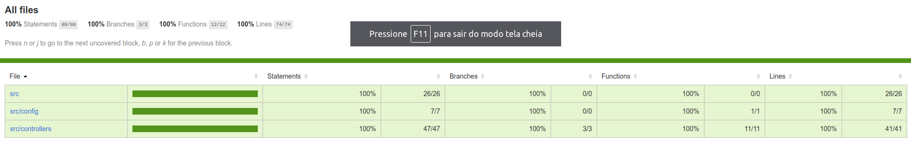

[](https://code.visualstudio.com/)


# Projeto Ecoleta da Next Level Week

Minha implementação do projeto Ecoleta, um sistema de ajuda para encontrar e cadastrar pontos
de coleta de diferente resíduos.

- Frontend com React e Typescript
- Backend com Node.js, Typescript e SQLite como banco de dados
- Mobile com o Expo
- Testes com Jest

## Executando a Aplicação:

```sh
  # Instale as dependências
  $ npm install

  ## Crie o banco de dados
  $ cd server
  $ npm run knex:migrate
  $ npm run knex:seed

  # Inicie a API
  $ npm run dev

  # Inicie a aplicação web
  $ cd web
  $ npm start

  # Inicie a aplicação mobile
  $ cd mobile
  $ npm start
```

OBS:

- É **necessário** possuir o **[Node.js](https://nodejs.org/en/)** instalado na máquina
- Também, é **preciso** ter um gerenciador de pacotes seja o **[NPM](https://www.npmjs.com/)** ou **[Yarn](https://yarnpkg.com/)**.
- Por fim, é **essencial** ter o **[Expo](https://expo.io/)** instalado de forma global na máquina

## Resultado

<h1 align="center">
    
</h1>

<h1 align="center">
    
</h1>

<h1 align="center">
    
</h1>

<h1 align="center">
    
</h1>

<h1 align="center">
    
</h1>

## Cobertura dos testes

<h1 align="center">
    
</h1>
